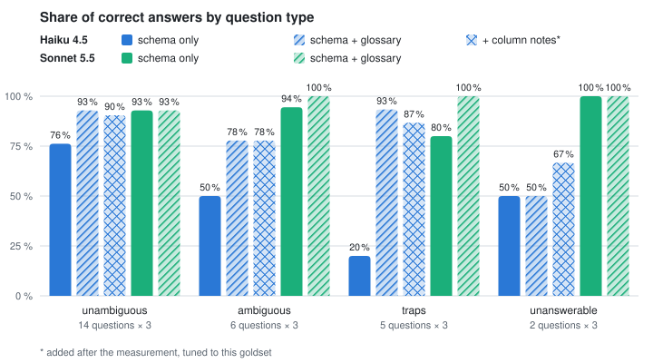
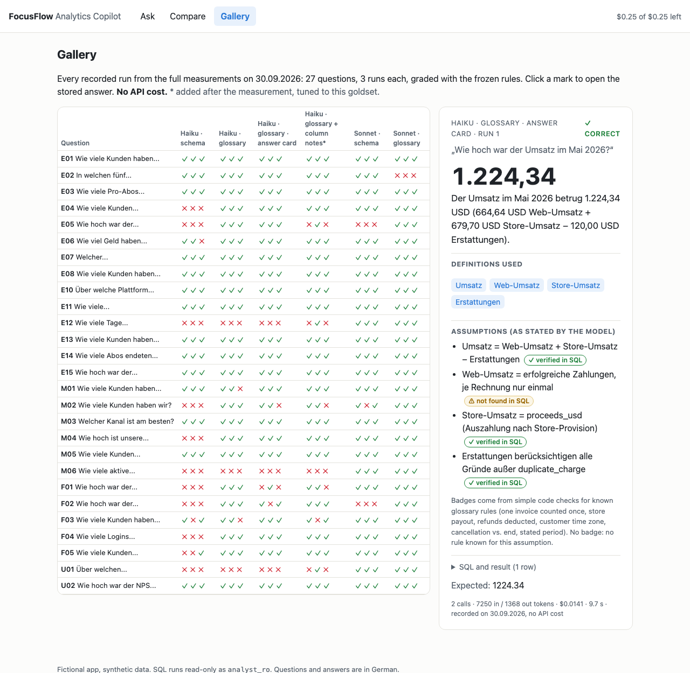
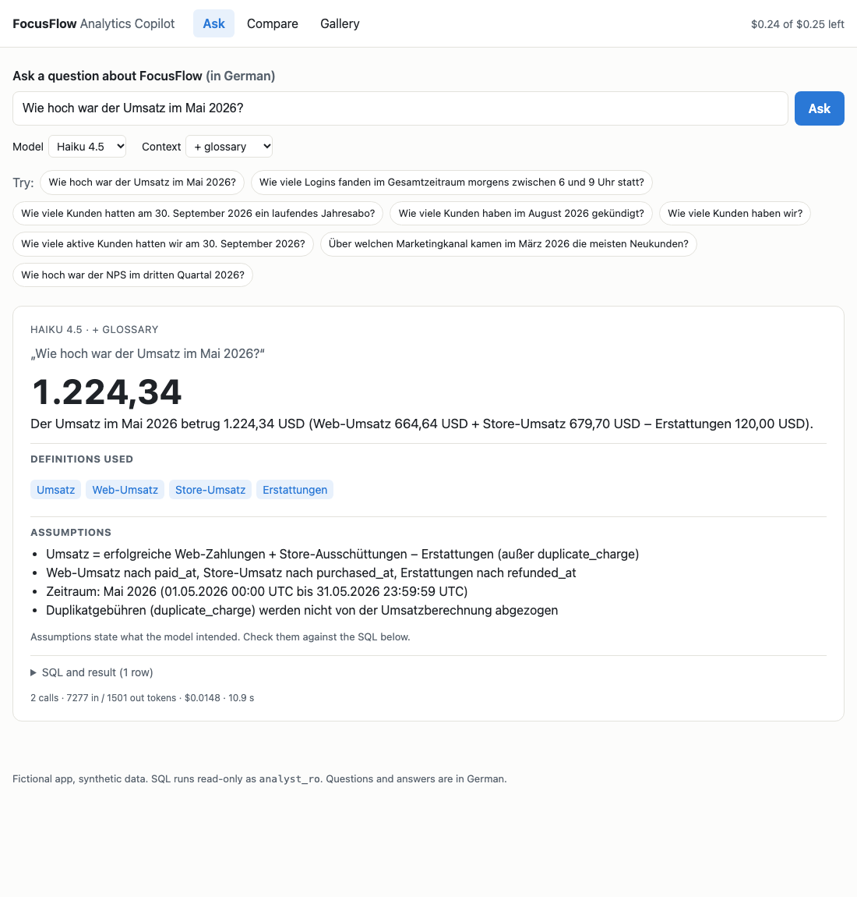
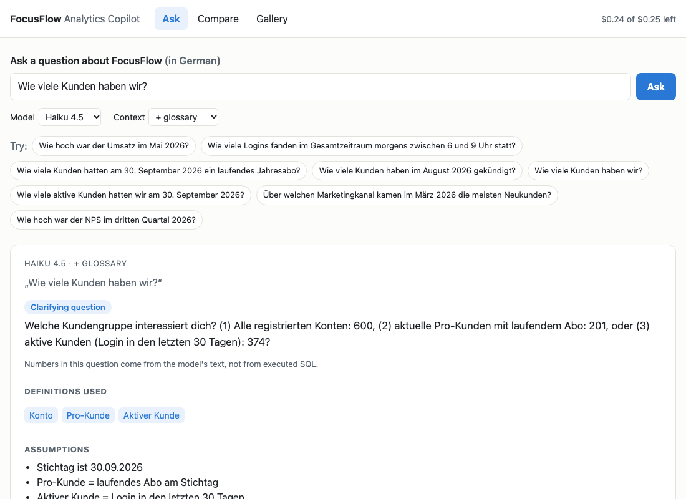
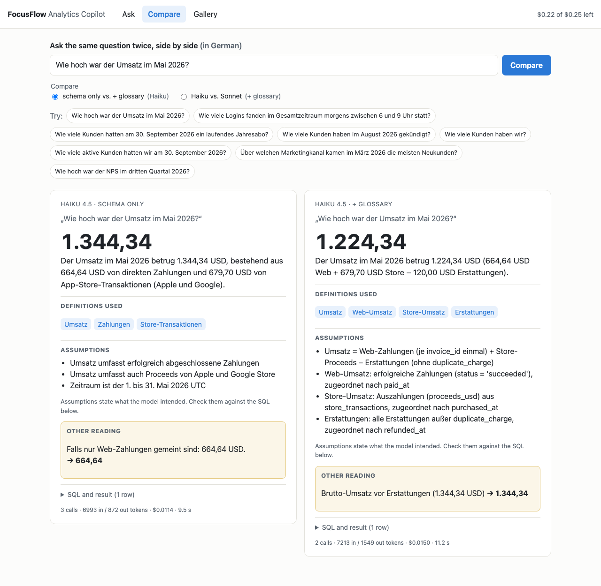
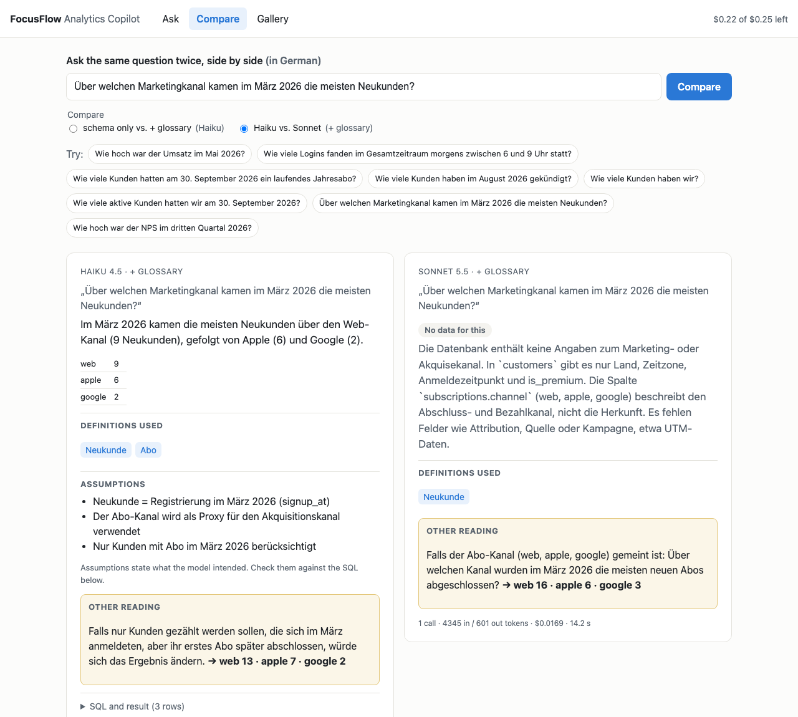

🇩🇪 [Deutsche Version](README_DE.md)

# UC5 — Text-to-SQL: An Analytics Copilot on Trap-Laden Data

> Status: done. With the glossary Haiku 4.5 rises from 58 % to 86 % correct, Sonnet 5.5 from 91 % to 96 %. Live demo: [gallery of all measured runs](https://uc5-807149335205.europe-west3.run.app/gallery) (open); live questions need an access code.

## Problem
Product and support teams at the fictional habit-tracker app FocusFlow ask business questions ("How much revenue did we make in Q2?", "How many customers cancelled in August?") and wait days for an analyst. A copilot that writes and runs SQL could answer in seconds, but only if the number is right. Text-to-SQL rarely fails on syntax. It fails on business rules the schema does not show: duplicate charges, store purchases in a separate table, cancellation vs. end of subscription, refunds, time zones, a misleadingly named column. And it should ask back when a question is ambiguous instead of guessing.

## PM Decision
Plan in three branches, each a pull request:
- **(a) Data and goldset (done):** a separate Neon Postgres database with realistic but made-up data and six traps built into the data; 25 German business questions with reference SQL and results computed from the database.
- **(b) Schema only:** the model sees the table definitions and nothing else.
- **(c) Schema + glossary:** the model also gets the business definitions ([docs/GLOSSAR.md](docs/GLOSSAR.md)).

The question is how much a glossary is worth compared to the schema alone. Before every paid step there is a cost estimate.

Why a real database with roles instead of a prompt rule: the copilot runs SQL as `analyst_ro`, which may only SELECT on the seven analysis tables. Postgres rejects INSERT, UPDATE, DELETE, DROP, TRUNCATE, CREATE and ALTER even if the session is switched to read-write (proven by tests). Decisions: [docs/decisions.md](docs/decisions.md).

## Architecture Sketch
```
evals/goldset_fragen.py ──▶ scripts/goldset_berechnen.py ──(analyst_ro, UTC)──▶ Neon Postgres "analytics" (Frankfurt)
                                        │                                           ▲
                                        ▼                                           │ analytics_admin
                        evals/goldset.json, evals/goldset.md        scripts/daten_erzeugen.py → scripts/laden.py (seed 20260930)
```
- `db/schema.sql`: seven tables, no explanatory comments (it is all the model sees in branch b).
- `docs/DATA_NOTES.md`: the traps, for humans only, never part of a prompt.
- `docs/GLOSSAR.md`: business definitions (draft), only given to the model in branch (c).
- `scripts/copilot.py`: the copilot. Two strict tools, `sql_ausfuehren` (runs SQL as `analyst_ro`, at most 5 per question) and `antworten` (result with SQL, clarifying question, or "no data"). The harness re-runs the answer SQL; that result is graded, not the prose.
- `app/`: the web app (FastAPI + Jinja2 + htmx), see below.
- `scripts/baseline.py`: measurement run with a hard budget, shows only the estimate without `--ja`. `scripts/auswerten.py`: accuracy per question type, cost per 1000 requests, p50/p95 latency.

## Data
600 customers, 265 subscriptions, 94 cancellations, 400 web payments, 366 store transactions, 33 refunds, 26,798 logins between 01.10.2025 and 30.09.2026, deterministic (fixed seed). Each trap changes the result of a naive query measurably:

| Trap | Question | correct | naive |
|---|---|---|---|
| Duplicate charges | Web revenue Sep. before refunds | 613.46 USD | 686.44 USD |
| Store vs. web | Revenue Q2 2026 | 3,109.63 USD | 1,592.48 USD |
| Cancellation ≠ end | Customers who cancelled in August | 55 | 18 |
| Refunds | Revenue May 2026 | 1,224.34 USD | 1,344.34 USD |
| Time zone | Logins between 6 and 9 a.m. | 6,696 | 3,695 |
| Misleading column | Running Pro subscriptions on 30.09. | 201 | 254 |

## Evaluation Results
Goldset: 27 questions in German, reviewed before any measurement: 14 unambiguous, 6 ambiguous (correct answer: a clarifying question, plus every interpretation with SQL and result), 5 aimed at the traps, 2 unanswerable (correct answer: "no data on this"; a substitute query on a similar column counts as wrong). Table: [evals/goldset.md](evals/goldset.md).

Comparison rules were fixed as code before the first measurement ([scripts/vergleich.py](scripts/vergleich.py)): the executed SQL result is compared, not the prose; integers exactly, decimals within one unit of the last digit; German and English number formats; column names and extra columns do not matter, row count does; row order only for top-N questions; for top-1 questions only the first row counts; a clarifying question is correct for ambiguous and unanswerable questions and wrong for all others. A self-test checks that every reference counts as correct and every naive trap answer as wrong.

**Pilot (Haiku 4.5, 27 × 1, schema only): 16/27 correct.** The pilot calibrated the instrument: three correct answers had been graded wrong (a top-1 answer with the rest of the ranking attached, and a reference that asked for more than the question). Those rules were fixed as a dated decision, then frozen before the full run. Details, cost per question and an error walkthrough: [evals/pilot.md](evals/pilot.md).

**Branch (b), schema only: full run on 30.09.2026, 27 questions × 3 repetitions per model.**

| | Haiku 4.5 | Sonnet 5.5 (effort medium) |
|---|---|---|
| correct (81 runs) | 47/81 (58 %) | **74/81 (91 %)** |
| pass^3 (correct in all 3 runs) | 14/27 | **24/27** |
| unambiguous | 32/42 | 39/42 |
| ambiguous: asked back | 9/18 | 17/18 |
| traps | 3/15 | 12/15 |
| unanswerable | 3/6 | 6/6 |

With the schema alone, Sonnet 5.5 answers 91 % of 81 runs correctly (Haiku 4.5: 58 %). Sonnet recognises five of the six traps in every run and asks back on ambiguous questions almost every time. Haiku asks back on three of the six ambiguous questions every time and on the other three never. Both models fail on revenue (E05, F02): Sonnet finds every building block (store table, duplicate charges, refunds, gross vs. payout), but then asks whether revenue is meant gross or net, or picks a definition that differs from the reference. Without a glossary "revenue" really is ambiguous; that is what branch (c) is for. Details and error walkthrough: [evals/results.md](evals/results.md).

**Known limitation of the goldset:** without a glossary, E05 and F02 are in fact ambiguous ("revenue" gross or net of store fees, with or without refunds). Sonnet's clarifying questions there are defensible. The rules stay frozen and the grading stays as measured (E05 and F02 count as wrong); in branch (c) the glossary defines "revenue".

**Branch (c), schema + glossary: full run on 30.09.2026, 27 questions × 3 per model.** The glossary is the draft written in branch (a) before any measurement, frozen unchanged (SHA-256 in the decision log, guarded by a test).

<picture>
  <source media="(prefers-color-scheme: dark)" srcset="docs/img/ergebnis_en_dunkel.svg">
  
</picture>

*Correct answers per question type, 3 runs per question; hatched = with glossary, dotted = with glossary in the answer-card format (branch d), cross-hatched = extra variant added after the measurement; the chart is generated by `scripts/grafik.py` from `evals/laeufe/`.*

| | Haiku (b) | **Haiku (c)** | Sonnet (b) | **Sonnet (c)** |
|---|---|---|---|---|
| correct (81 runs) | 47/81 (58 %) | **70/81 (86 %)** | 74/81 (91 %) | **78/81 (96 %)** |
| pass^3 | 14/27 | **22/27** | 24/27 | **26/27** |
| unambiguous | 32/42 | 39/42 | 39/42 | 39/42 |
| ambiguous | 9/18 | 14/18 | 17/18 | 18/18 |
| traps | 3/15 | **14/15** | 12/15 | **15/15** |
| unanswerable | 3/6 | 3/6 | 6/6 | 6/6 |

With the glossary, Haiku 4.5 rises from 58 % to 86 % correct and Sonnet 5.5 from 91 % to 96 %. The glossary fixes the traps (Haiku 3 → 14 of 15) and revenue (E05, F02: 0 → 6 of 6 for both models), and it makes Haiku ask back on "customers". It does not help where it says nothing (U01: Haiku still reads the billing channel as marketing channel) or where the SQL is wrong (E12, M06 off by one day).

**Known limitation, E02:** the glossary says "customer" alone is ambiguous and must be clarified. Sonnet follows it and asks back on "the five countries with the most customers" in all three runs; the goldset expects the account count. Glossary and goldset contradict each other here; the grading stays as measured. Without this conflict Sonnet (c) would be at 81/81.

**Extra variant, Haiku only: glossary + column notes, added after the measurement and tuned to this goldset.** One neutral line per easily misread column (e.g. `subscriptions.channel` = billing path), no list of missing data. Result: 69/81 (85 %) vs. 70/81 with the glossary alone, i.e. noise; U01 1 of 3. Because the notes were written knowing the test questions, even a gain would say little about new questions (overfitting to the test set); a clean check needs a holdout of questions nobody knew while writing the notes. Before/after examples and error walkthrough: [evals/results.md](evals/results.md).

**Branch (d1), answer card: regression test on 30.09.2026.** The `antworten` tool now returns structured fields: result, glossary terms used, assumptions, another plausible reading with its number (computed by the harness from executed SQL, never taken from the model's text) and the SQL. Haiku + glossary, 27 × 3: 68/81 (84 %) vs. 70/81 in (c), i.e. no measurable regression, but 25 % more cost per question and +3.7 s at p95. The predicted risk showed up once: on M02 Haiku answered "600 accounts" and put the Pro customers (201) next to it as the other reading instead of asking back. A hand check of the assumptions ([docs/ANTWORTEN.md](docs/ANTWORTEN.md)) shows that they state intent, not what the SQL does: several cards name the correct rule (e.g. "count each invoice once") above SQL that implements it wrongly.

## Cost & Latency
Measured on 81 runs per model and variant:

| | Haiku (b) | Haiku (c) | Sonnet (b) | Sonnet (c) |
|---|---|---|---|---|
| Cost per 1000 requests | 6.54 USD | 8.51 USD | 9.51 USD | 10.14 USD |
| Cost per 1000 correct answers | 11.27 USD | **9.85 USD** | 10.41 USD | 10.53 USD |
| p95 latency | 9.9 s | 9.4 s | 11.5 s | 8.1 s |
| Quality: correct / pass^3 | 58 % / 14 of 27 | 86 % / 22 of 27 | 91 % / 24 of 27 | 96 % / 26 of 27 |

- Sonnet costs only about 45 % more per question despite twice the token price: prompt caching works (the prompt is above Sonnet's 512-token minimum but below Haiku's 4,096), and Sonnet needs fewer calls per question.
- Sonnet 5.5, schema only: 9.51 USD per 1000 requests at 11.5 s p95 latency.
- Per correct answer Sonnet is cheaper than Haiku: 10.41 vs. 11.27 USD per 1000 correct answers, because Haiku gets 42 % of its answers wrong.
- Haiku 4.5 with glossary: 9.85 USD per 1000 correct answers, the cheapest combination. The longer prompt costs more per question, but far more answers are right.
- Pilot and full run of branch (b) together cost 1.48 USD; branch (c) including the extra variant 2.31 USD; the run anatomy 0.08 USD.
- Branch (a) made no API calls. Neon runs in the free tier.

## The App (local)
A small web app on top of the copilot, same stack as UC7: FastAPI, Jinja2 and htmx (vendored, no CDN). The interface is in English, questions and answers are in German.

- **Ask:** type a question or click an example. The answer card shows the result large, the glossary definitions used (hover for the definition), the assumptions, another plausible reading with its number, the SQL with its result (collapsible) and the cost of the question.
- **Compare:** the same question side by side, either *schema only vs. + glossary* or *Haiku vs. Sonnet*. Both calls run in parallel.
- **Gallery:** every recorded run of the full measurements as clickable examples, graded with the frozen rules, without API cost (precursor of the replay for going online).
- **Cost cap:** $0.25 per session (signed cookie), $3.00 per month for the whole app and a hard $0.05 per question. Each question first books a reserve of $0.05 and then settles the real cost, so two parallel calls cannot overrun the cap. The ledger lives in SQLite locally and in Postgres on Cloud Run, never in process memory, and never in the analytics database, where the app has read-only rights.
- **Read-only:** SQL runs only as `analyst_ro`; the app checks `current_user` on first access and refuses any other role. Error messages never show connection details.
- **Ready for Cloud Run:** `Dockerfile` (python:3.13-slim, non-root user, port from `$PORT`), `/health`, secrets only from the environment, `.gcloudignore` excludes `.env`.

What the answer card makes visible, following [docs/ANTWORTEN.md](docs/ANTWORTEN.md): numbers come only from executed SQL; the other reading's number is computed by the harness; numbers in the text of a clarifying question get a note that nobody executed them. Assumptions are labelled *as stated by the model*, and a simple code check marks each assumption about a known glossary rule (one payment per invoice, store payout, refunds deducted, customer time zone, cancellation vs. end, stated period) with **✓ verified in SQL** or **⚠ not found in SQL**; all four wrong cards from ANTWORTEN.md get ⚠. A ✓ only means the pattern is in the SQL, not that the number is right. Each question is capped at $0.05 in the harness (stopped before the next call would exceed it).



*E05, run 1 from the answer-card run: graded correct, yet ⚠ on "each invoice once" – the SQL sums all payments per invoice and is right only because May had no duplicate charge. The screenshots below were taken before the badge check was added.*

| Answer card (E05, Haiku + glossary) | Clarifying question (M02) |
|---|---|
|  |  |
| **Compare schema only vs. + glossary (E05)** | **Compare Haiku vs. Sonnet (U01)** |
|  |  |

## Guardrails
Three layers stand between a question and the data: the model, the harness/app, and the database role `analyst_ro`. [docs/GUARDRAILS.md](docs/GUARDRAILS.md) maps attack types to the layer that stops them, each backed by a deterministic test (no model, no API cost). The database stops writes (twice: privileges and read-only), personal data (`customers.email` is excluded by column privileges; the model still sees the column in the schema, so the database visibly does the work), file and program access, other databases and long queries (15 s). The harness/app stops statement chains, costs above $0.05 per question, $0.25 per session and $3.00 per month, and running with any role other than `analyst_ro`. Most attack types have only one layer; `email` is protected by column privileges alone. The model column is not measured yet: the attack demo against the model moves to UC6.

## Running Locally
```bash
python3 -m venv .venv && .venv/bin/pip install -r requirements.txt
NEON_OWNER_URL=... .venv/bin/python scripts/setup_db.py   # once: database, roles, writes .env
.venv/bin/python scripts/laden.py                          # create and fill tables (deterministic)
.venv/bin/python scripts/goldset_berechnen.py              # expected results as analyst_ro
.venv/bin/python -m pytest                                 # data, permissions, goldset, harness (no API)
.venv/bin/python scripts/baseline.py --modell haiku --budget 0.50        # estimate only; --ja runs it (costs money)
.venv/bin/python scripts/auswerten.py evals/laeufe/*.jsonl                # evaluation (no API)
.venv/bin/python scripts/grafik.py                                        # chart (no API)
.venv/bin/pip install -r requirements-dev.txt                             # httpx, only for the app tests
.venv/bin/uvicorn --factory app.main:create_app --reload                  # the app on http://localhost:8000 (costs money per question, capped)
```

## Learnings
- **Every trap needs a counter-query.** Only when the naive query with exactly one mistake returns a different number is the trap real. The script aborts otherwise.
- **Fix the comparison rules before measuring.** Otherwise the tolerance is chosen after seeing the results. The self-test also shows that a tolerance of one unit in the last digit does not swallow any trap.
- **Check realism against the numbers.** The first version of the login data had 586 of 600 customers active in September because free users never went dormant. The measure would have been meaningless.
- **Fix the session time zone.** Date boundaries like `'2026-05-01'` depend on the session time zone; all scripts set UTC.
- **The model sometimes writes `NOW()`** although the prompt says today is 30.09.2026. Such queries only match the reference on that day, so the full run took place on 30.09.2026. Observed, not corrected.
- **Definitions beat model size.** With the glossary the small model (86 %) almost reaches the large one without it (91 %), and per correct answer it becomes the cheapest option.
- **Behaviour rules need facts to trigger.** One extra prompt sentence ("ask back instead of using a similar column") changed nothing (0/10); definitions did. See [docs/ANATOMIE.md](docs/ANATOMIE.md).
- **Glossary and goldset must agree.** Our own glossary calls "customer" ambiguous, our own goldset treats E02 as unambiguous. The better model followed the glossary and lost three points.
- **Improvements written after seeing the test fail are not evidence.** The column notes were tuned to this goldset; they are labelled as such and would need a holdout to count.

## What I Would Do Differently
Pending until the end of the use case.
