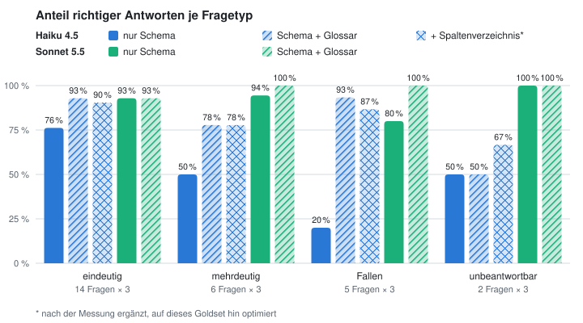

🇬🇧 [English version](README.md)

# UC5 — Text-to-SQL: Ein Analytics-Copilot auf Daten mit Fallen

> Stand: in Arbeit. Branch (a) ist fertig: Datenbank, Daten und Goldset. Branch (b) ist gemessen: nur Schema, Sonnet 5.5 91 %, Haiku 4.5 58 % richtig. Branch (c) (Glossar) folgt.

## Problem
Produkt- und Support-Teams der fiktiven Habit-Tracker-App FocusFlow stellen Business-Fragen („Wie viel Umsatz hatten wir im Q2?“, „Wie viele Kunden haben im August gekündigt?“) und warten Tage auf einen Analysten. Ein Copilot, der SQL schreibt und ausführt, könnte in Sekunden antworten, aber nur, wenn die Zahl stimmt. Text-to-SQL scheitert selten an der Syntax. Es scheitert an Geschäftsregeln, die das Schema nicht zeigt: Doppelabbuchungen, Store-Käufe in einer eigenen Tabelle, Kündigung vs. Abo-Ende, Erstattungen, Zeitzonen, eine irreführend benannte Spalte. Und er soll bei mehrdeutigen Fragen zurückfragen statt zu raten.

## PM-Entscheidung
Plan in drei Branches, jeweils ein Pull Request:
- **(a) Daten und Goldset (fertig):** eigene Neon-Postgres-Datenbank mit realistischen, aber erfundenen Daten und sechs in die Daten eingebauten Fallen; 25 Business-Fragen auf Deutsch mit Referenz-SQL und aus der Datenbank berechneten Ergebnissen.
- **(b) Nur Schema:** Das Modell sieht die Tabellendefinitionen und sonst nichts.
- **(c) Schema + Glossar:** Das Modell bekommt zusätzlich die Geschäftsdefinitionen ([docs/GLOSSAR.md](docs/GLOSSAR.md)).

Die Frage ist, wie viel ein Glossar gegenüber dem Schema allein bringt. Vor jedem kostenpflichtigen Schritt gibt es eine Kostenschätzung.

Warum eine echte Datenbank mit Rollen statt einer Regel im Prompt: Der Copilot führt SQL als `analyst_ro` aus, der nur SELECT auf die sieben Analyse-Tabellen darf. Postgres weist INSERT, UPDATE, DELETE, DROP, TRUNCATE, CREATE und ALTER ab, auch wenn die Sitzung auf Lesen und Schreiben umgestellt wird (per Test belegt). Entscheidungen: [docs/decisions.md](docs/decisions.md).

## Architekturskizze
```
evals/goldset_fragen.py ──▶ scripts/goldset_berechnen.py ──(analyst_ro, UTC)──▶ Neon Postgres "analytics" (Frankfurt)
                                        │                                           ▲
                                        ▼                                           │ analytics_admin
                        evals/goldset.json, evals/goldset.md        scripts/daten_erzeugen.py → scripts/laden.py (Seed 20260930)
```
- `db/schema.sql`: sieben Tabellen, ohne erklärende Kommentare (in Branch b das Einzige, was das Modell sieht).
- `docs/DATA_NOTES.md`: die Fallen, nur für Menschen, nie Teil eines Prompts.
- `docs/GLOSSAR.md`: Geschäftsdefinitionen (Entwurf), bekommt das Modell erst in Branch (c).
- `scripts/copilot.py`: der Copilot. Zwei strikte Werkzeuge, `sql_ausfuehren` (führt SQL als `analyst_ro` aus, höchstens 5 je Frage) und `antworten` (Ergebnis mit SQL, Rückfrage oder „keine Daten“). Der Harness führt die Antwort-SQL erneut aus; bewertet wird dieses Ergebnis, nicht der Text.
- `scripts/baseline.py`: Messlauf mit hartem Budget, zeigt ohne `--ja` nur die Schätzung. `scripts/auswerten.py`: Trefferquote je Fragetyp, Kosten je 1000 Requests, p50/p95-Latenz.

## Daten
600 Kunden, 265 Abos, 94 Kündigungen, 400 Web-Zahlungen, 366 Store-Käufe, 33 Erstattungen, 26.798 Logins zwischen 01.10.2025 und 30.09.2026, deterministisch (fester Seed). Jede Falle ändert das Ergebnis einer naiven Abfrage messbar:

| Falle | Frage | richtig | naiv |
|---|---|---|---|
| Doppelabbuchungen | Web-Umsatz Sep. vor Erstattungen | 613,46 USD | 686,44 USD |
| Store vs. Web | Umsatz Q2 2026 | 3.109,63 USD | 1.592,48 USD |
| Kündigung ≠ Abo-Ende | Kunden mit Kündigung im August | 55 | 18 |
| Erstattungen | Umsatz Mai 2026 | 1.224,34 USD | 1.344,34 USD |
| Zeitzone | Logins zwischen 6 und 9 Uhr | 6.696 | 3.695 |
| Irreführende Spalte | Laufende Pro-Abos am 30.09. | 201 | 254 |

## Evaluationsergebnisse
Goldset: 27 Fragen auf Deutsch, vor jeder Messung durchgesehen: 14 eindeutig, 6 mehrdeutig (richtige Antwort: eine Rückfrage, dazu jede Deutung mit SQL und Ergebnis), 5 gezielt auf die Fallen, 2 unbeantwortbar (richtige Antwort: „keine Daten dazu“; eine Ersatz-Abfrage mit ähnlicher Spalte gilt als falsch). Tabelle: [evals/goldset.md](evals/goldset.md).

Die Vergleichsregeln stehen vor der ersten Messung als Code fest ([scripts/vergleich.py](scripts/vergleich.py)): verglichen wird das Ergebnis der ausgeführten SQL, nicht der Fließtext; Ganzzahlen exakt, Dezimalzahlen auf eine Einheit der letzten Stelle; deutsches und englisches Zahlenformat; Spaltennamen und zusätzliche Spalten egal, die Zeilenzahl nicht; Zeilenreihenfolge nur bei Top-N-Fragen; bei Top-1-Fragen zählt nur die erste Zeile; eine Rückfrage ist bei mehrdeutigen und unbeantwortbaren Fragen richtig, bei allen anderen falsch. Ein Selbsttest prüft, dass jede Referenz als richtig und jede naive Fallen-Antwort als falsch gilt.

**Pilot (Haiku 4.5, 27 × 1, nur Schema): 16/27 richtig.** Der Pilot hat das Messinstrument kalibriert: Drei richtige Antworten waren als falsch gewertet worden (eine Top-1-Antwort mit angehängter übriger Rangliste und eine Referenz, die mehr verlangte als die Frage). Diese Regeln wurden als datierte Entscheidung korrigiert und vor dem vollen Lauf eingefroren. Details, Kosten je Frage und Fehler-Rundgang: [evals/pilot.md](evals/pilot.md).

**Branch (b), nur Schema: voller Lauf am 30.09.2026, 27 Fragen × 3 Wiederholungen je Modell.**

<picture>
  <source media="(prefers-color-scheme: dark)" srcset="docs/img/ergebnis_de_dunkel.svg">
  
</picture>

*Richtige Antworten je Fragetyp, 3 Läufe je Frage; die Grafik erzeugt `scripts/grafik.py` aus `evals/laeufe/`.*

| | Haiku 4.5 | Sonnet 5.5 (effort medium) |
|---|---|---|
| richtig (81 Läufe) | 47/81 (58 %) | **74/81 (91 %)** |
| pass^3 (in allen 3 Läufen richtig) | 14/27 | **24/27** |
| eindeutig | 32/42 | 39/42 |
| mehrdeutig: Rückfrage | 9/18 | 17/18 |
| Fallen | 3/15 | 12/15 |
| unbeantwortbar | 3/6 | 6/6 |

Mit dem Schema allein beantwortet Sonnet 5.5 91 % von 81 Läufen richtig (Haiku 4.5: 58 %). Sonnet erkennt fünf der sechs Fallen in jedem Lauf und fragt bei mehrdeutigen Fragen fast immer nach. Haiku fragt bei drei der sechs mehrdeutigen Fragen immer nach, bei den anderen drei nie. Beide Modelle scheitern am Umsatz (E05, F02): Sonnet findet alle Bausteine (Store-Tabelle, Doppelabbuchungen, Erstattungen, Brutto gegenüber Auszahlung), fragt dann aber nach, ob der Umsatz brutto oder netto gemeint ist, oder wählt eine andere Definition als die Referenz. Ohne Glossar ist „Umsatz“ tatsächlich mehrdeutig, genau dafür ist Branch (c) da. Details und Fehler-Rundgang: [evals/results.md](evals/results.md).

**Bekannte Grenze des Goldsets:** Ohne Glossar sind E05 und F02 faktisch mehrdeutig („Umsatz“ brutto oder nach Store-Gebühr, mit oder ohne Erstattungen). Sonnets Rückfragen dort sind vertretbar. Die Regeln bleiben eingefroren, die Bewertung bleibt wie gemessen (E05 und F02 zählen als falsch); in Branch (c) definiert das Glossar „Umsatz“.

## Kosten & Latenz
Branch (b), nur Schema, gemessen an je 81 Läufen:

| | Haiku 4.5 | Sonnet 5.5 |
|---|---|---|
| Kosten pro 1000 Requests | 6,54 USD | 9,51 USD |
| Kosten pro 1000 richtige Antworten | 11,27 USD | 10,41 USD |
| p95-Latenz | 9,9 s | 11,5 s |
| Qualität: richtig / pass^3 | 58 % / 14 von 27 | 91 % / 24 von 27 |

- Sonnet kostet je Frage nur rund 45 % mehr, obwohl der Tokenpreis doppelt so hoch ist: Das Prompt-Caching greift (der Prompt liegt über Sonnets Minimum von 512 Tokens, aber unter Haikus 4.096), und Sonnet braucht weniger Aufrufe je Frage.
- Sonnet 5.5: 9,51 USD pro 1000 Requests bei 11,5 s p95-Latenz.
- Je richtige Antwort ist Sonnet günstiger als Haiku: 10,41 gegenüber 11,27 USD pro 1000 richtige Antworten, weil Haiku 42 % seiner Antworten falsch beantwortet.
- Pilot und voller Lauf von Branch (b) kosteten zusammen 1,48 USD.
- Branch (a) machte keine API-Aufrufe. Neon läuft im Free-Tier.

## Lokal ausführen
```bash
python3 -m venv .venv && .venv/bin/pip install -r requirements.txt
NEON_OWNER_URL=... .venv/bin/python scripts/setup_db.py   # einmalig: Datenbank, Rollen, schreibt .env
.venv/bin/python scripts/laden.py                          # Tabellen anlegen und füllen (deterministisch)
.venv/bin/python scripts/goldset_berechnen.py              # erwartete Ergebnisse als analyst_ro
.venv/bin/python -m pytest                                 # Daten, Rechte, Goldset, Harness (ohne API)
.venv/bin/python scripts/baseline.py --modell haiku --budget 0.50        # nur Schätzung; --ja startet (kostet Geld)
.venv/bin/python scripts/auswerten.py evals/laeufe/*.jsonl                # Auswertung (ohne API)
.venv/bin/python scripts/grafik.py                                        # Grafik (ohne API)
```

## Learnings
- **Jede Falle braucht eine Gegenabfrage.** Erst wenn die naive Abfrage mit genau einem Fehler eine andere Zahl liefert, ist die Falle echt. Das Skript bricht sonst ab.
- **Vergleichsregeln vor der Messung festlegen.** Sonst wird die Toleranz gewählt, nachdem man die Ergebnisse gesehen hat. Der Selbsttest zeigt außerdem, dass eine Toleranz von einer Einheit der letzten Stelle keine Falle verschluckt.
- **Realismus an den Zahlen prüfen.** Die erste Fassung der Login-Daten hatte 586 von 600 Kunden im September aktiv, weil Gratis-Nutzer nie einschliefen. Die Kennzahl wäre wertlos gewesen.
- **Sitzungs-Zeitzone festlegen.** Datumsgrenzen wie `'2026-05-01'` hängen von der Zeitzone der Sitzung ab; alle Skripte setzen UTC.
- **Das Modell schreibt manchmal `NOW()`**, obwohl der Prompt den 30.09.2026 als heute nennt. Solche Abfragen treffen die Referenz nur an diesem Tag, deshalb lief der volle Lauf am 30.09.2026. Beobachtet, nicht korrigiert.

## Was ich anders machen würde
Folgt zum Abschluss des Use Cases.
